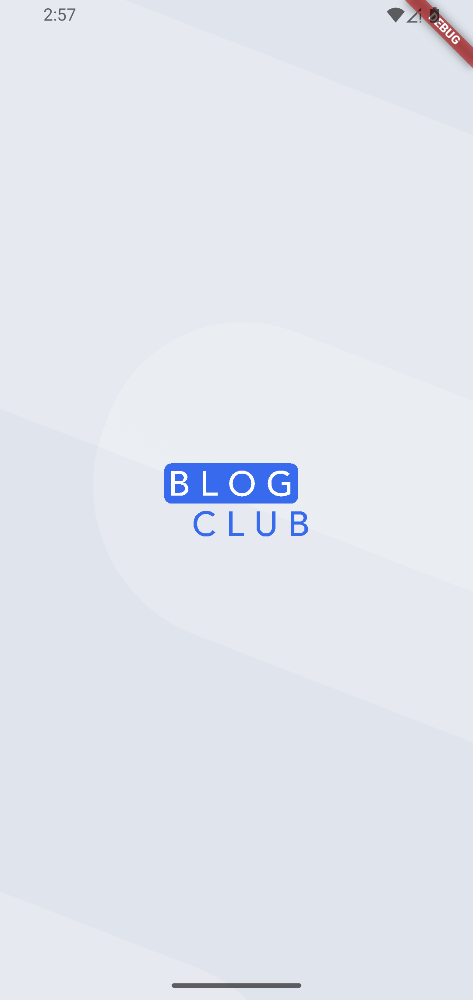
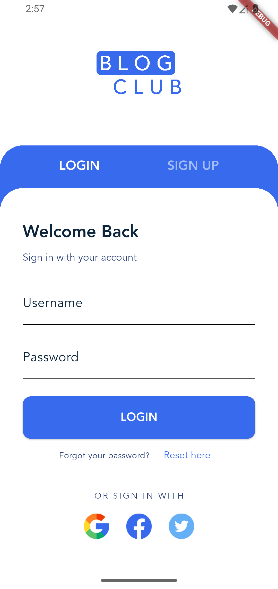
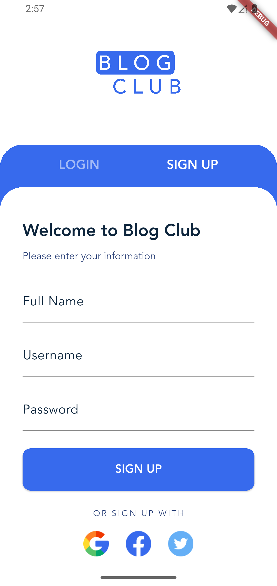
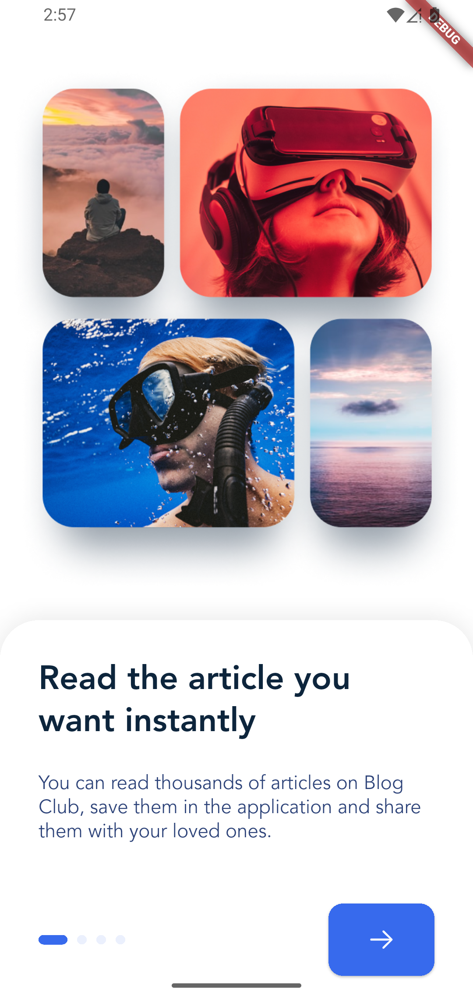
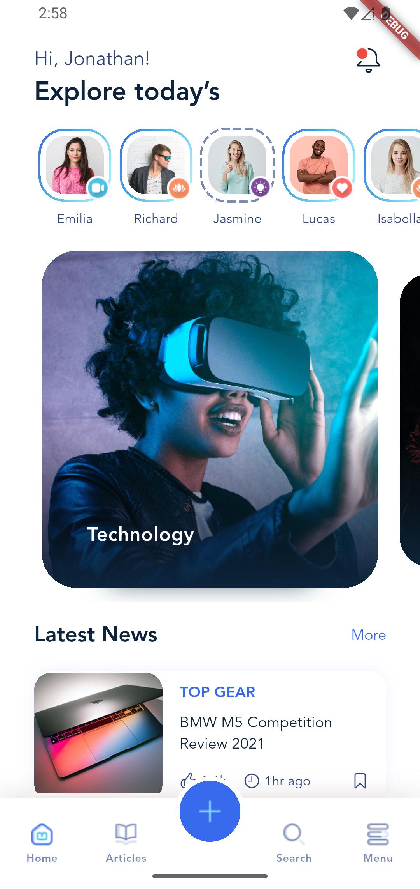
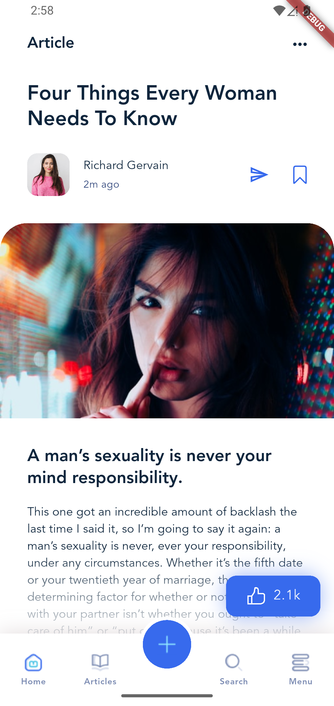
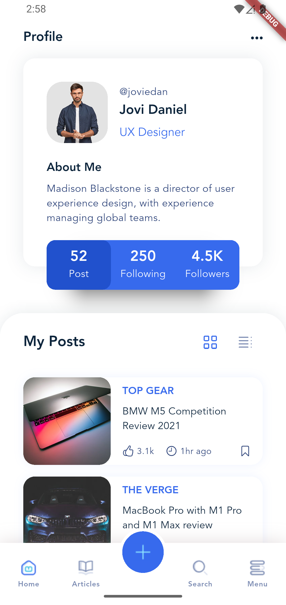

# Flutter BLOG CLUB UI App

This is a **Flutter application** built for practicing **UI implementation**.  
The design is based on the following **Dribbble UI Kit**, and the main pages have been implemented in Flutter:

🔗 [Dribbble Design Link](https://dribbble.com/shots/15039580-BLOG-CLUB-Blog-UI-kit-Freebie)

---

## 📱 Features
- UI implementation based on the Dribbble Blog UI Kit  
- Multiple main pages recreated in Flutter  
- Clean and simple structure, focused only on **UI practice**  

---

## 🖼️ Screenshots

<p align="center">
  
  
  
</p>

<p align="center">
  
  
  
</p>

<p align="center">
  
</p>

---

## 🚀 How to Run
1. Clone the repository or download the project files:
   ```bash
   git clone https://github.com/AmirhosseinHY/blog-club-app.git